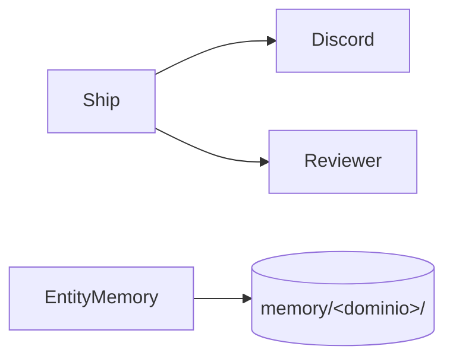

# Auxiliary Skills

## Responsabilidade

Skills auxiliares do package fora do feature workflow: memória de entidades, entrega de PR até o deploy, mensagens Discord por sessão e busca web.

## Componentes

- [MEMORY.md](./batista-MEMORY.md): playbook de memória técnica em `memory/<dominio>/`.
- [SHIP_PR_TO_DEPLOY.md](./batista-SHIP_PR_TO_DEPLOY.md): entrega ponta a ponta (commit → PR → CR → CI → merge → tag → deploy → release).
- [DISCORD.md](./batista-DISCORD.md): mensagens Discord via bot, por sessão e canal.
- [WEBSEARCH.md](./batista-WEBSEARCH.md): busca web via OpenRouter Web Search Plugin.

## Relações

## Fontes no código

- `skills/batista-memory/SKILL.md`
- `skills/batista-ship-pr-to-deploy/SKILL.md`
- `skills/batista-discord-webhook-messages/SKILL.md`
- `skills/batista-discord-webhook-messages/scripts/discord_message.py`
- `skills/batista-websearch/SKILL.md`
- `skills/batista-websearch/scripts/websearch.py`
