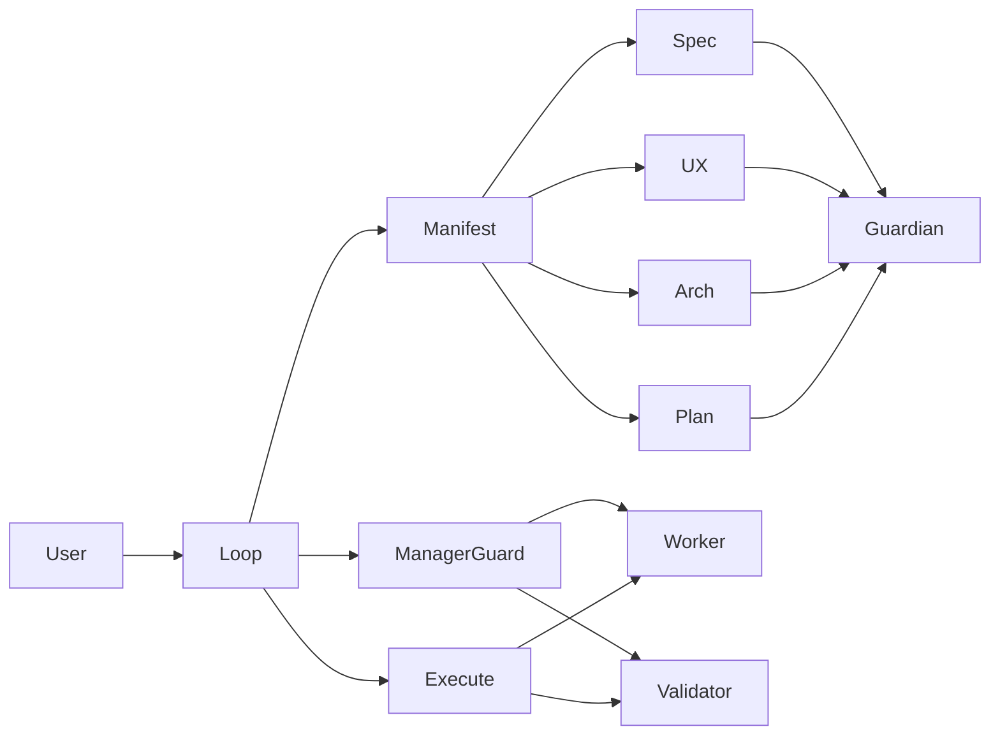

# Feature Workflow

## Responsabilidade

Mapear o harness de autoria, execução, validação e retomada oferecido pelo pi package.

## Componentes

- [LOOP.md](./LOOP.md): controlador ponta a ponta.
- [MANIFEST.md](./MANIFEST.md): manager de autoria.
- [SPEC.md](./SPEC.md): contrato e clarificações.
- [UX.md](./UX.md): solução de usabilidade.
- [ARCH.md](./ARCH.md): solução técnica.
- [PLAN.md](./PLAN.md): DAG executável e harness.
- [EXECUTE.md](./EXECUTE.md): coordenação de implementação.
- [SUBAGENTS.md](./SUBAGENTS.md): papéis e fronteiras do runtime.
- [MANAGER_GUARD.md](./MANAGER_GUARD.md): contenção nativa de tool calls dos managers.

## Relações

## Fontes no código

- `skills/`
- `agents/`
- `extensions/workflow-manager-guard.ts`
- `references/WORKFLOW_COMMON.md`
- `package.json`
