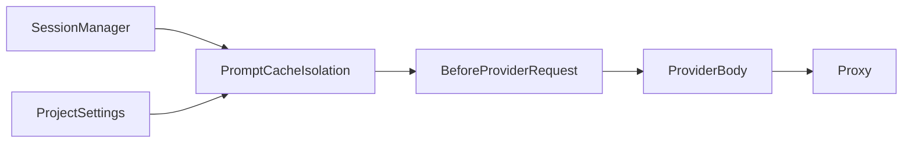

# Isolamento de prompt cache

## Responsabilidade

Mapear a extension que separa o prompt cache de sessões Pi/OMP por meio do campo `prompt_cache_key` no body OpenAI-compatible, com seleção declarativa por projeto.

## Componentes

- [PROMPT_CACHE_ISOLATION.md](./PROMPT_CACHE_ISOLATION.md): extension, contrato de seleção e fluxo de request.

## Relações

## Fontes no código

- `extensions/prompt-cache-isolation.js`
- `test/prompt-cache-isolation.test.mjs`
- `README.md`
